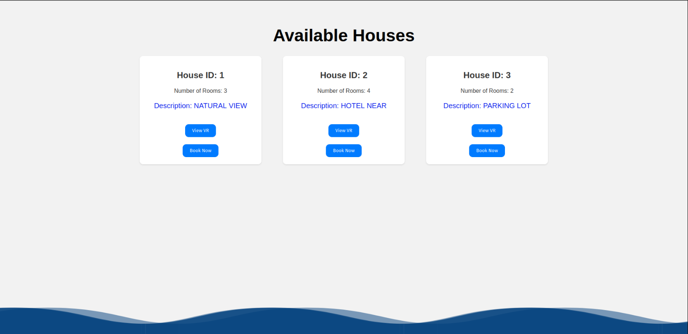

# Room Booking System

This project is a web-based room booking system built using Python, HTML, and CSS. The system allows users to book rooms for various purposes through a user-friendly interface. It also includes an admin panel for managing room bookings.

## Features

- **User Authentication**: Secure login and registration for users.
- **Room Availability Check**: Users can check the availability of rooms before booking.
- **Admin Panel**: Admins can view, add, and delete room bookings.
- `3D View of Rooms: Explore our rooms in detail with realistic 3D views, helping you make informed booking decisions.`

  
## Screenshots

### Login Page


### Home page


### Booking Page



### Form Page


### Admin Panel


## Hosted Application

You can access the hosted application at [Room Booking System](https://vaitheeshwarij14.pythonanywhere.com/).

- **Regular User**: 
  - Username: `s.ac.in`
  - Password: `123`
- **Admin User**:
  - Username: `b`
  - Password: `456`

## Installation

### Prerequisites

- Python 3.x
- Flask
- SQLite

### Steps

1. **Clone the repository:**
    ```bash
    git clone https://github.com/saliniyan/room_booking_mine.git
    ```

2. **Navigate to the project directory:**
    ```bash
    cd room_booking_mine
    ```

3. **Create a virtual environment (optional but recommended):**
    ```bash
    python -m venv venv
    source venv/bin/activate  # On Windows, use `venv\Scripts\activate`
    ```

4. **Install the required dependencies:**
    ```bash
    pip install -r requirements.txt
    ```


5. **Run the application:**
    ```bash
    python index.py
    ```

## Usage

1. Open your browser and navigate to `http://localhost:5000`.
2. Register for a new account or log in with an existing one.
3. To book a room, navigate to the booking page, select the desired room, date, and time, and confirm the booking.
4. Admin users can log in to access the admin panel where they can manage bookings.

## Folder Structure

- `static/`: Contains static files such as CSS, JavaScript, and images.
    - `css/`: Contains CSS files for styling.
    - `js/`: Contains JavaScript files for dynamic behavior.
    - `images/`: Contains image files used in the application.
    
- `templates/`: Contains HTML templates for rendering web pages.
    - `index.html`: The main page of the application.
    - `login.html`: The login page.
    - `register.html`: The registration page.
    - `booking.html`: The room booking page.
    - `admin.html`: The admin panel page.
    
- `index.py`: The main application file that initializes and runs the Flask app.
- `site.db`: SQLite database file used to store user and booking data.
- `models.py`: Contains the database models for the application.
- `forms.py`: Contains the forms used for user input.
- `routes.py`: Contains the route definitions for handling web requests.

## Contributing

1. Fork the repository.
2. Create a new branch (`git checkout -b feature-branch`).
3. Make your changes.
4. Commit your changes (`git commit -m 'Add some feature'`).
5. Push to the branch (`git push origin feature-branch`).
6. Open a pull request.


## Contact

For any questions or feedback, please open an issue on GitHub or contact saliniyanp02@gmail.com.
